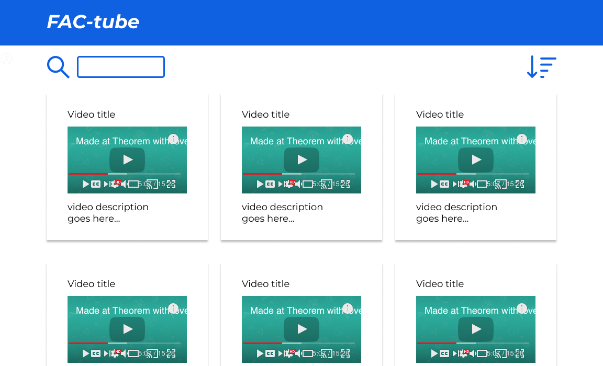
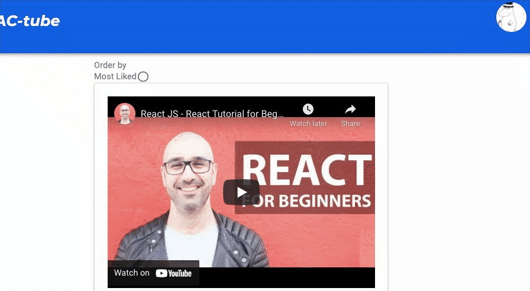
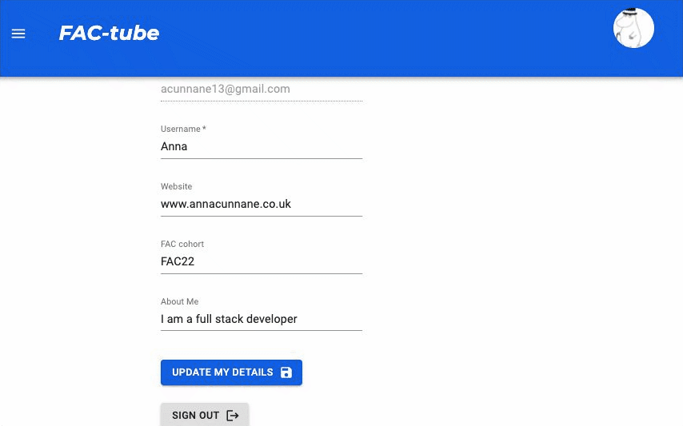
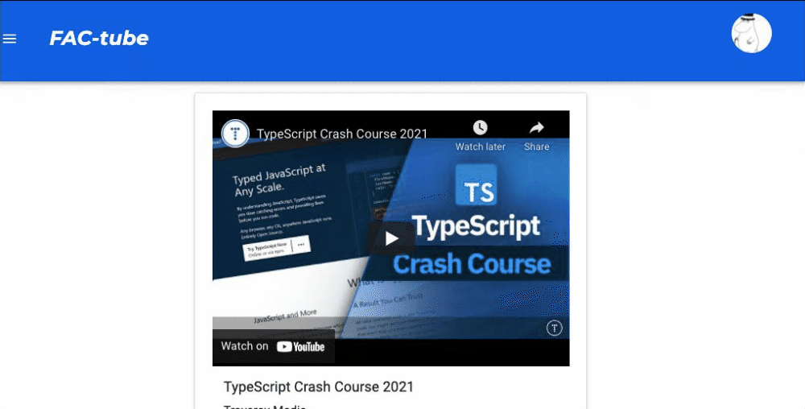

# FAC-Tube 📺

## The Product

FAC-Tube is a website where members of the FAC community
(applicants, current cohorts, alumni) can easily find and recommend useful coding YouTube videos.

## Our Team

- [Anna](https://github.com/Moggach) (QA)
- [Danilo](https://github.com/danilo-cupido) (DevOps)
- [Mohamed](https://github.com/Alisyad9)(UX)
- [Barbara](https://github.com/0bubbles0) (Scrum)

Many thanks to our project & role mentors, the FAC team and our code reviewers 🎉

## Tech Stack 🥞

- Miro & Figma for Wireframing 🎨
- Material UI for CSS components 💅
- Next.js with React.js for front-end & back-end 🚀
- Supabase for our Postgres database & Authentication 🔑
- Cypress for Testing 🌲
- Vercel for Deployment ⚡️

### To view this project

1. [`See our deployed version on Vercel here`](https://fac-tube.vercel.app/)
2. Run the code locally

Clone the repo

`cd` into the folder and run

`NPM install`

then

`NPM run dev `

## What we learnt 📚

📌 How to analyse a problem we believed our users were facing

📌 How to conduct user research to test our assumptions in that process

📌 How to create a prototype based on that research

📌 How to test our prototype with users

📌 How to make adjustments to our prototype based on user feedback and identify an MVP

📌 How to plan two build sprints to make that MVP

📌 How to set up a Supabase database and access it using Next.js functions such as `getServerSideProps()`

📌 How to query the YouTube API with a user generated search term and display the results on the page 📺

📌 How to find and install relevant packages from NPM e.g. ReactPlayer 🧩

📌 How to handle user authentification and login using Supabase

📌 How to use Material UI to write our CSS

📌 How to handle insertions and updates to our database based on user input

📌 How to render different UIs depending on whether a user has logged in and who the user is 👩🏻‍💻

### Wireframing & Prototype

Our wireframes in Figma

### Our MVP

Our MVP is based on the features our user research had identified as the most important 📝

It has a home page with a community video library that is sortable by most liked

a user can search YouTube

a user can view and update their profile

a user can add a video to their library

a user can view their added videos in their library

a user can like a video

### Future improvements 🕰

📌 A user should be able to apply tags to a video depending on topic,
video features etc

📌 A user should be able to see who has liked a video

📌 Users should be able to view each other's profiles

📌 A user should be able to add a video to their library
with just a YouTube url

📌 More resuable code/components

### Challenges

- Learning new technologies 😓

- Length of project 📅

- Understanding the scope of the project - what was possible and what not to build

### Sprint planning 🏃‍♀️

Our [Kanban](https://github.com/fac22/FACTube/projects/1) board with time estimations and labels based on issue type and priority

✅ Daily stand ups

✅ Frequent merge and code review

✅ Swapping over work on challenging areas and sharing knowedge

✅ Asking questions - of mentors and in Help and Solutions

### Build Sprint 1 🧱

- Setting up Next.js with initial Vercel deployment
- YouTube API search feature 🔎
- Like button component 💖

### Build Sprint 2 🧱🧱

- User login/sign out and authentification
- CSS with Material UI
- User can view and update their profile
- User can view their library and add a video to the library
- User can like a video which increments the likes counter and is stored against their user id

### Bugs 🐛

Lots of bugs!

- Fetching from a Supabase database using async functions was tricky to render on the page using React
- Customising Materials UI was harder than expected
- Our YouTube API key often maxxed out
- Vercel sometimes gave us errors in deployment that were not apparent in development
